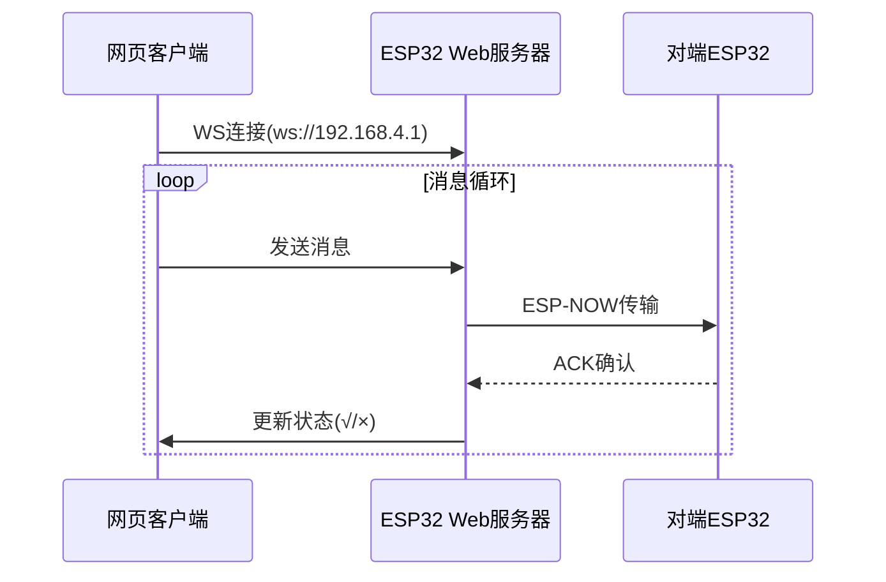

```markdown
# 📡 ESP32 ESP-NOW双向通信与Web实时消息系统

  
*通过ESP-NOW协议实现设备间可靠通信，结合WebSocket提供实时网页交互*

## 🚀 核心功能
- **双重通信协议**  
  `ESP-NOW`直连传输 + `WebSocket`实时推送
- **消息可靠性**  
  ✔️ 消息ID标记 ✔️ ACK确认机制 ✔️ 2秒超时重传
- **可视化监控**  
  Web界面实时显示：`发送中` → `√成功` / `×失败`
- **即插即用**  
  📶 自动创建WiFi热点，手机/电脑直接访问

## 📚 目录
- [硬件要求](#-硬件要求)
- [快速部署](#-快速部署)
- [系统架构](#-系统架构)  
- [代码结构](#-代码结构)
- [进阶配置](#-进阶配置)  
- [故障排查](#-故障排查)
- [许可证](#-许可证)

---

## 🛠️ 硬件要求
| 组件               | 规格                  |
|--------------------|-----------------------|
| ESP32开发板        | 建议使用ESP32-S3      |
| USB数据线          | Type-C接口            | 
| 电源               | 5V/2A适配器           |
| 网络环境           | 2.4GHz WiFi频段       |

---

## ⚡ 快速部署

### 1. 环境配置
1. 安装Arduino IDE（≥2.0）
2. 添加开发板支持：
   ```bash
   https://raw.githubusercontent.com/espressif/arduino-esp32/gh-pages/package_esp32_index.json
   ```
3. 安装库：
   - ESPAsyncWebServer
   - WebSockets
   - Adafruit MQTT Library

### 2. 设备配对
```cpp
// 修改目标设备MAC地址（两个设备需互相配置）
uint8_t peerAddress[] = {0xCC,0xBA,0x97,0x0F,0x2C,0x74}; 

// 设置AP热点（两台设备不同名称）
WiFi.softAP("ESP32-Chat_1", "12345678");  // 设备1
WiFi.softAP("ESP32-Chat_2", "12345678");  // 设备2
```

### 3. 烧录程序
```bash
# 使用PlatformIO快速编译
pio run --target upload --environment esp32dev
```

---

## 🌐 系统架构


---

## 📂 代码结构
```
src/
├── main.cpp                # 主程序逻辑
├── config.h                # 设备配置参数
├── websocket_handler.cpp   # WebSocket事件处理
└── espnow_handler.cpp      # ESP-NOW通信核心
```

关键函数说明：
```cpp
void sendMessage(String msg) {
    // 生成消息ID → 存储待确认列表 → ESP-NOW发送
}

void checkTimeouts() {
    // 每2秒检查未确认消息 → 自动重传（最多3次）
}
```

---

## 🔧 进阶配置

### 增加传感器数据
```cpp
struct_message {
    ...
    float temperature;  // 新增温度字段
    uint8_t humidity;   // 新增湿度字段
};
```

### 修改重传策略
```cpp
// 在checkTimeouts()中修改
if (currentTime - sendTime > 5000) {  // 改为5秒超时
    retryCount++;                     // 添加重试计数器
    if(retryCount < 5) {...}         // 限制最大重试次数
}
```

---

## 🚨 故障排查

| 现象                 | 解决方案                |
|----------------------|-------------------------|
| 无法建立WebSocket连接 | 检查防火墙设置/端口占用 |
| ACK确认超时           | 确认MAC地址配置正确     |
| 网页显示断连         | 重新连接WiFi热点       |
| 数据包丢失           | 缩短设备间距离         |

---

## 📜 许可证
**MIT License**  
允许商业用途，需保留原始版权声明。完整许可文本见 [LICENSE](LICENSE) 文件。

---
```

> 项目演示视频与详细文档请访问：https://github.com/yourusername/esp32-espnow-websocket/wiki
