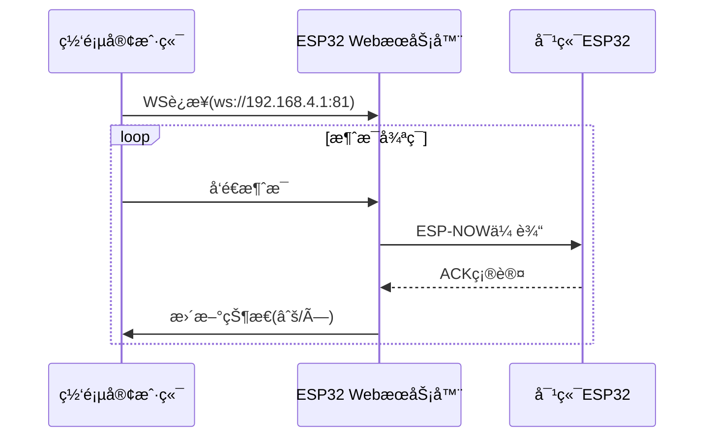

嗯，用户ç°åœ¨éœ€è¦å†™ä¸€ä¸ªå…³äºä»–们æ供的ESP32代ç çš„GitHub仓库介ç»çš„Markdown文档。他们已ç»ç»™å‡ºäº†ä»£ç ï¼Œå¹¶ä¸”之å‰å·²ç»ç”Ÿæˆäº†ä¸€ä¸ªç±»ä¼¼çš„中文介ç»ï¼Œç°åœ¨ä»–们想把这个转æ¢æˆMarkdownæ ¼å¼ã€‚我需è¦åˆ†æ用户的需求，确定哪些部分需è¦è¢«åŒ…å«åœ¨Markdown中，以åŠå¦‚何结æ„化这个文档。

首先，用户æ供的代ç æ˜¯ä¸€ä¸ªESP32çš„åŒå‘通信项目，结åˆäº†ESP-NOWå议和WebSocket技术。代ç ä¸­å®ç°äº†æ¶ˆæ¯ç¡®è®¤ã€è¶…æ—¶é‡ä¼ ï¼Œè¿˜æœ‰ç½‘页界é¢ã€‚用户之å‰å·²ç»å†™äº†ä¸€ä¸ªæ¯”较详细的中文介ç»ï¼Œç°åœ¨éœ€è¦å°†å…¶è½¬æ¢ä¸ºMarkdownæ ¼å¼ï¼Œå¯èƒ½éœ€è¦æ›´æ¸…晰的结æ„和适当的格å¼ã€‚

用户å¯èƒ½å¸Œæœ›è¿™ä¸ªMarkdown文档包å«é¡¹ç›®æ¦‚è¿°ã€åŠŸèƒ½ç‰¹æ€§ã€æŠ€æœ¯æ¶æ„图ã€ç¡¬ä»¶è¦æ±‚ã€å¿«é€Ÿå…¥é—¨æŒ‡å—ã€æ¶ˆæ¯å¤„ç†æµç¨‹ã€æ‰©å±•æ¥å£ã€æ³¨æ„事项ã€è®¸å¯è¯ç­‰ä¿¡æ¯ã€‚åŒæ—¶ï¼Œå¯èƒ½éœ€è¦ä½¿ç”¨ä»£ç å—ã€æ ‡é¢˜ã€åˆ—表ã€è¡¨æ ¼ã€Mermaidæµç¨‹å›¾ç­‰Markdown元素æ¥å¢å¼ºå¯è¯»æ€§ã€‚

我需è¦æ£€æŸ¥ç”¨æˆ·ä¹‹å‰æ供的中文介ç»ï¼Œçœ‹çœ‹æœ‰æ²¡æœ‰é—æ¼çš„部分，或者å¯ä»¥ä¼˜åŒ–的地方。例如，技术æ¶æ„部分用户使用了Mermaid图表，这在Markdown中是支æŒçš„，但å¯èƒ½éœ€è¦ç¡®è®¤è¯­æ³•æ˜¯å¦æ­£ç¡®ã€‚å¦å¤–，快速开始部分需è¦ç¡®ä¿æ­¥éª¤æ¸…晰，代ç ç¤ºä¾‹æ­£ç¡®ã€‚

还è¦æ³¨æ„用户æ到的“写markdownâ€å¯èƒ½æ„味ç€ä»–们希望得到一个å¯ä»¥ç›´æ¥å¤åˆ¶åˆ°GitHubçš„README.md文件，所以格å¼å¿…须正确，没有语法错误。å¯èƒ½éœ€è¦å°†ä¹‹å‰çš„介ç»é‡æ–°ç»„织，使用适当的标题级别，添加必è¦çš„代ç å—和链æ¥ã€‚

å¦å¤–，用户å¯èƒ½åœ¨æ³¨æ„事项部分æ到了MAC地å€é…ç½®ã€è·ç¦»é™åˆ¶ã€ä¼šè¯è¶…时等，需è¦ç¡®ä¿è¿™äº›å†…容在Markdown中以列表或强调的方å¼å‘ˆç°ã€‚许å¯è¯éƒ¨åˆ†é€šå¸¸ä½¿ç”¨æ ‡å‡†çš„MIT License声æ˜ï¼Œå¯èƒ½éœ€è¦è¡¥å……版æƒä¿¡æ¯ã€‚

最å，检查整个文档的结æ„是å¦æµç•…，逻辑是å¦æ¸…晰，确ä¿ç”¨æˆ·èƒ½å¤ŸæŒ‰ç…§æ­¥éª¤é¡ºåˆ©éƒ¨ç½²é¡¹ç›®ï¼Œå¹¶ç†è§£å„部分的功能和å®ç°æ–¹å¼ã€‚如æœæœ‰ä¸ç¡®å®šçš„地方，å¯èƒ½éœ€è¦å‚考常è§çš„ESP32项目文档结æ„，确ä¿ç¬¦åˆæœ€ä½³å®è·µã€‚


以下是整ç†åçš„Markdown文档：

```markdown
# 📡 ESP32 ESP-NOWåŒå‘通信ä¸Webå®æ—¶æ¶ˆæ¯ç³»ç»Ÿ

  
*通过ESP-NOWåè®®å®ç°è®¾å¤‡é—´å¯é é€šä¿¡ï¼Œç»“åˆWebSocketæä¾›å®æ—¶ç½‘页交互*

## 🚀 核心功能
- **åŒé‡é€šä¿¡åè®®**  
  `ESP-NOW`ç›´è¿ä¼ è¾“ + `WebSocket`å®æ—¶æ¨é€
- **消æ¯å¯é æ€§**  
  âœ”ï¸ æ¶ˆæ¯ID标记 âœ”ï¸ ACK确认机制 âœ”ï¸ 2秒超时é‡ä¼ 
- **å¯è§†åŒ–监æ§**  
  Webç•Œé¢å®æ—¶æ˜¾ç¤ºï¼š`å‘é€ä¸­` → `√æˆåŠŸ` / `×失败`
- **å³æ’å³ç”¨**  
  📶 自动创建WiFi热点，手机/电脑直æ¥è®¿é—®

## 📚 目录
- [硬件è¦æ±‚](#-硬件è¦æ±‚)
- [快速部署](#-快速部署)
- [系统æ¶æ„](#-系统æ¶æ„)  
- [代ç ç»“æ„](#-代ç ç»“æ„)
- [进阶é…ç½®](#-进阶é…ç½®)  
- [æ•…éšœæ’查](#-æ•…éšœæ’查)
- [许å¯è¯](#-许å¯è¯)

---

## ğŸ› ï¸ ç¡¬ä»¶è¦æ±‚
| 组件               | 规格                  |
|--------------------|-----------------------|
| ESP32å¼€å‘æ¿        | 建议使用ESP32-S3      |
| USBæ•°æ®çº¿          | Type-Cæ¥å£            | 
| ç”µæº               | 5V/2A适é…器           |
| 网络ç¯å¢ƒ           | 2.4GHz WiFi频段       |

---

## ⚡ 快速部署

### 1. ç¯å¢ƒé…ç½®
1. 安装Arduino IDE（≥2.0）
2. 添加开å‘æ¿æ”¯æŒï¼š
   ```bash
   https://raw.githubusercontent.com/espressif/arduino-esp32/gh-pages/package_esp32_index.json
   ```
3. 安装库：
   - ESPAsyncWebServer
   - WebSockets
   - Adafruit MQTT Library

### 2. 设备é…对
```cpp
// 修改目标设备MAC地å€ï¼ˆä¸¤ä¸ªè®¾å¤‡éœ€äº’相é…置）
uint8_t peerAddress[] = {0xCC,0xBA,0x97,0x0F,0x2C,0x74}; 

// 设置AP热点（两å°è®¾å¤‡ä¸åŒå称）
WiFi.softAP("ESP32-Chat_1", "12345678");  // 设备1
WiFi.softAP("ESP32-Chat_2", "12345678");  // 设备2
```

### 3. 烧录程åº
```bash
# 使用PlatformIO快速编译
pio run --target upload --environment esp32dev
```

---

## 🌠系统æ¶æ„


---

## 📂 代ç ç»“æ„
```
src/
├── main.cpp                # 主程åºé€»è¾‘
├── config.h                # 设备é…ç½®å‚æ•°
├── websocket_handler.cpp   # WebSocket事件处ç†
└── espnow_handler.cpp      # ESP-NOW通信核心
```

关键函数说æ˜ï¼š
```cpp
void sendMessage(String msg) {
    // 生æˆæ¶ˆæ¯ID → 存储待确认列表 → ESP-NOWå‘é€
}

void checkTimeouts() {
    // æ¯2ç§’æ£€æŸ¥æœªç¡®è®¤æ¶ˆæ¯ â†’ 自动é‡ä¼ ï¼ˆæœ€å¤š3次）
}
```

---

## 🔧 进阶é…ç½®

### å¢åŠ ä¼ æ„Ÿå™¨æ•°æ®
```cpp
struct_message {
    ...
    float temperature;  // æ–°å¢æ¸©åº¦å­—段
    uint8_t humidity;   // æ–°å¢æ¹¿åº¦å­—段
};
```

### 修改é‡ä¼ ç­–ç•¥
```cpp
// 在checkTimeouts()中修改
if (currentTime - sendTime > 5000) {  // 改为5秒超时
    retryCount++;                     // 添加é‡è¯•è®¡æ•°å™¨
    if(retryCount < 5) {...}         // é™åˆ¶æœ€å¤§é‡è¯•æ¬¡æ•°
}
```

---

## 🚨 æ•…éšœæ’查

| ç°è±¡                 | 解决方案                |
|----------------------|-------------------------|
| 无法建立WebSocketè¿æ¥ | 检查防ç«å¢™è®¾ç½®/端å£å ç”¨ |
| ACK确认超时           | 确认MAC地å€é…置正确     |
| ç½‘é¡µæ˜¾ç¤ºæ–­è¿         | é‡æ–°è¿æ¥WiFi热点       |
| æ•°æ®åŒ…丢失           | 缩短设备间è·ç¦»         |

---

## 📜 许å¯è¯
**MIT License**  
å…许商业用途，需ä¿ç•™åŸå§‹ç‰ˆæƒå£°æ˜ã€‚完整许å¯æ–‡æœ¬è§ [LICENSE](LICENSE) 文件。

---
```

> 项目演示视频ä¸è¯¦ç»†æ–‡æ¡£è¯·è®¿é—®ï¼šhttps://github.com/yourusername/esp32-espnow-websocket/wiki
